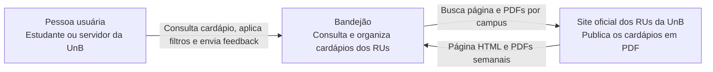
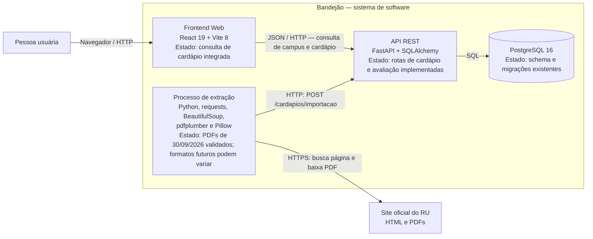
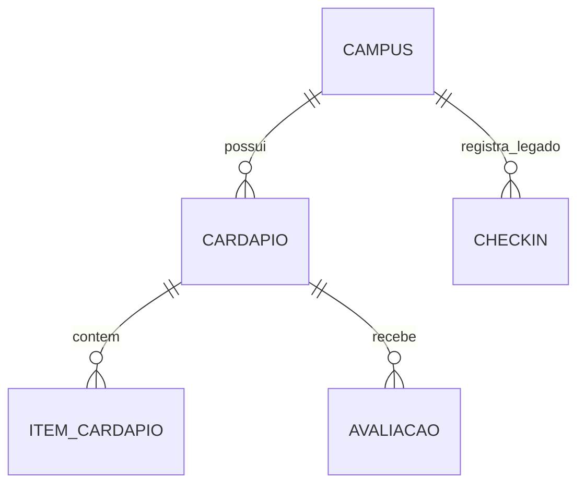

# Documento de Arquitetura — Bandejão

**Projeto:** Bandejão — Cardápio e Fila dos RUs da UnB

**Escopo:** arquitetura da Release 1 e direção da Release 2

**Estado do código consultado:** 30/09/2026

## 1. Propósito e estado

Este documento apresenta a arquitetura do Bandejão nos níveis de **Contexto** e **Containers** do modelo C4, o modelo de dados existente e os fluxos principais. Os diagramas distinguem a arquitetura pretendida do estado implementado: backend, banco e extração já têm código; a interface React consulta campi e cardápios pela API, enquanto filtros alimentares, avaliações e reclamações ainda estão pendentes.

O Bandejão centraliza os cardápios publicados em PDF pelos Restaurantes Universitários da UnB. A Release 1 prevê consulta do cardápio por campus, filtros alimentares, avaliações e reclamações. O planejamento semanal e a estimativa de movimento pertencem à Release 2.

## 2. C4 — Diagrama de Contexto

A pessoa usuária consulta o Bandejão. O sistema também depende do site oficial do RU para descobrir e baixar os PDFs semanais. Não há API oficial de cardápios.

## 3. C4 — Diagrama de Containers

O container de extração é um comando Python separado. O Docker Compose local sobe apenas banco, API e frontend; não agenda nem executa a extração.

### Responsabilidade e estado de cada container

| Container | Responsabilidade | Implementação observada |
|---|---|---|
| Frontend Web | Seleção de campus e consulta de cardápios por período e refeição | React 19 e Vite 8; consulta `GET /campi/` e `GET /cardapios/`, com URL configurável por `VITE_API_BASE_URL`. Filtros alimentares, avaliações e reclamações ainda não estão integrados. |
| API REST | Validar importações, consultar cardápios e receber avaliações | FastAPI e SQLAlchemy; rotas de campus, cardápio/importação e avaliação existentes. CORS permite origens configuradas em `CORS_ORIGINS`. Reclamações e planejamento não existem ainda. |
| PostgreSQL | Persistir campi, cardápios, itens, avaliações e check-ins legados | PostgreSQL 16 no Docker Compose; schema gerenciado pelo Alembic. |
| Processo de extração | Encontrar PDFs, extrair e normalizar dados e enviá-los à API | Pacote Python separado; pode rodar uma vez ou em loop com intervalo, mas não tem agendador no Compose. A publicação consultada em 30/09/2026 foi validada; ver [relatório dos PDFs](validacao-extracao-pdfs.md). Formatos futuros precisam de nova conferência. |

## 4. Fluxos principais

### 4.1 Importação de cardápio

1. O processo de extração solicita a página oficial do RU e encontra links de PDF por campus e período.
2. Baixa cada PDF e extrai datas, refeições, categorias, pratos e informação de dieta. A identificação de alérgenos compara os ícones das células com a legenda visual do PDF. Nos arquivos validados em 30/09/2026, a legenda não apresenta símbolo separado para frutos do mar; essa informação permanece indisponível.
3. Converte o resultado em um payload normalizado e envia `POST /cardapios/importacao`.
4. A API valida campos, enums e alérgenos e grava os registros no PostgreSQL.
5. A chave lógica de uma refeição é `(campus, data, tipo_refeicao)`. Reimportar essa chave substitui os itens anteriores, atualiza a URL de origem e preserva o registro do cardápio e suas avaliações.

A rotina isola falhas por campus durante o processamento. A disponibilidade e a qualidade do cardápio dependem da publicação do RU e da execução bem-sucedida da extração. A importação ainda não tem autenticação; antes de expor a API publicamente, deve ser protegida ou isolada da rede pública, pois pode substituir dados.

### 4.2 Consulta e feedback

O frontend consulta `GET /campi/` e `GET /cardapios/`, enviando campus, intervalo opcional de datas e tipo de refeição. A URL é configurável por `VITE_API_BASE_URL`; a API habilita CORS para as origens listadas em `CORS_ORIGINS`. A interface não define uma semana padrão nem oferece filtro alimentar enquanto D01/D02 e a qualidade dos marcadores não forem validados.

As rotas para registrar e consultar avaliações existem em `/cardapios/{cardapio_id}/avaliacoes`. A interface correspondente está pendente. Reclamações separadas das notas são requisito da Release 1, mas ainda não têm modelo, migração ou endpoint.

### 4.3 Planejamento e previsão — Release 2

O código atual contém check-ins, que representam uma abordagem antiga. O requisito vigente substitui check-in por planejamento antecipado. Antes de desenhar o modelo e a previsão, é necessário decidir como coletar horário/faixa de chegada: campus, dia e refeição não bastam para inferir uma hora de pico.

## 5. Modelo de dados atual

O diagrama representa as tabelas/modelos existentes, não as funcionalidades futuras. `CheckIn` está marcado como legado e deve ser substituído conforme a Release 2 for projetada.

| Entidade | Dados principais | Relações e regras |
|---|---|---|
| `Campus` | Identificador e nome único | Um campus possui vários cardápios e check-ins legados. |
| `Cardapio` | Campus, data, tipo de refeição e URL do PDF | Único por campus + data + tipo de refeição; possui itens e avaliações. |
| `ItemCardapio` | Categoria, tipo de dieta, nome e indicadores booleanos de alérgenos | Pertence a um cardápio; os itens são substituídos ao reimportar a mesma refeição. |
| `Avaliacao` | Nota de 1 a 5, comentário opcional e data de criação | Pertence a um cardápio; o banco também impõe o intervalo da nota. |
| `CheckIn` | Campus e data/hora de criação | Pertence a um campus; entidade da abordagem anterior, sem horário previsto de chegada. |

Não há uma entidade separada `Refeicao`: no schema atual, `Cardapio` representa uma refeição de um campus numa data. Reclamação e planejamento semanal ainda são entidades futuras e não estão no diagrama do schema existente.

## 6. Fontes e disponibilidade dos dados

| Dado | Fonte | Frequência/atualização | Disponibilidade e risco |
|---|---|---|---|
| Cardápio | PDFs ligados pela página oficial `https://ru.unb.br/cardapio-refeitorio/` | A publicação é semanal; a extração busca os links quando é executada. | Não há API oficial. Links, tabelas e ícones podem mudar sem aviso; o cardápio também pode ser alterado pelo RU. |
| Campus | Nome extraído do arquivo ou já cadastrado no banco | Criado durante importação quando ainda não existe | A identificação depende dos nomes/formatos usados nos links dos PDFs. |
| Avaliação | Envio da pessoa usuária pela API | Registrada no envio | A API permite listar avaliações; o uso da interface está pendente. Não há conta de usuário associada no schema atual. |
| Reclamação | Prevista para a Release 1 | A definir | Ainda não há armazenamento ou endpoint; definir privacidade e política de retenção ao projetar. |
| Planejamento | Previsto para a Release 2 | A definir | Ainda não existe. A granularidade do horário precisa ser definida antes da previsão. |

## 7. Tecnologias

| Camada | Tecnologia observada |
|---|---|
| Extração | Python (versão não fixada), `requests`, BeautifulSoup, `pdfplumber` e Pillow |
| API | Python 3.12, FastAPI, SQLAlchemy, Pydantic Settings e Alembic |
| Banco de dados | PostgreSQL 16 |
| Frontend | React 19, JavaScript/JSX e Vite 8; TypeScript e Tailwind não aparecem na configuração atual do pacote |
| Ambiente local | Docker Compose; a extração roda separadamente |
| CI e publicação | `.github/workflows/ci.yml` executa testes do backend e da extração, além de lint e build do frontend em pull requests e mudanças da aplicação na `main`. `.github/workflows/docs.yml` valida a documentação em pull requests e publica o MkDocs no GitHub Pages na `main`. O deploy da aplicação ainda não está configurado. |

## 8. Interfaces relevantes

- `GET /health` — verificação básica da API.
- `GET /campi/` e `GET /campi/{id}` — consulta de campi.
- `GET /cardapios/` e `GET /cardapios/{id}` — consulta de cardápios; a listagem aceita filtros.
- `POST /cardapios/importacao` — contrato entre a extração e a API.
- `GET /cardapios/{id}/avaliacoes/` e `POST /cardapios/{id}/avaliacoes/` — histórico e criação de avaliação.
- `GET /campi/{id}/checkins/` e `POST /campi/{id}/checkins/` — endpoints legados a revisar ao implementar planejamento.

A documentação OpenAPI fica em `/docs` quando a API está em execução. O contrato detalhado do payload de importação está em `docs/handoff_banco_e_importacao.md`.

## 9. Ambiente local

O `docker-compose.yml` define PostgreSQL, backend e frontend. O README orienta criar `backend/.env` a partir do exemplo, executar `docker compose up --build` e depois aplicar as migrações com `docker compose exec backend alembic upgrade head`. Os endereços locais documentados são API `http://localhost:8000`, OpenAPI `http://localhost:8000/docs` e frontend `http://localhost:5173`.

A extração é iniciada à parte, a partir da pasta `extracao`, com `python -m extracao.sincronizar --backend-url http://localhost:8000`. O seed é apenas para desenvolvimento: ele remove o campus chamado “Gama” e dependências antes de recriar os dados de exemplo, portanto não deve ser usado em uma base com dados reais a preservar.

## 10. Restrições e decisões arquiteturais

- O extrator está separado da API porque o formato de origem é externo e frágil; ele conversa com o backend pelo contrato de importação, sem compartilhar tabelas ou sessão de banco.
- O backend atual é uma API única com persistência relacional; o projeto não tem necessidade observada de dividir serviços em microserviços.
- O Docker Compose descreve apenas o ambiente local. Execução periódica confiável da extração em produção ainda precisa de uma decisão de deploy/agendamento.
- CORS, autenticação da importação e hospedagem pública devem ser definidos antes de abrir o sistema para tráfego externo.
- Para Release 2, o dado coletado deve ter granularidade compatível com o que a previsão promete. Intenções por refeição não determinam um horário.

---

*Documento de arquitetura atualizado para refletir o schema e os componentes encontrados no repositório em 30/09/2026. Requisitos futuros estão identificados como planejados, não como implementação existente.*
